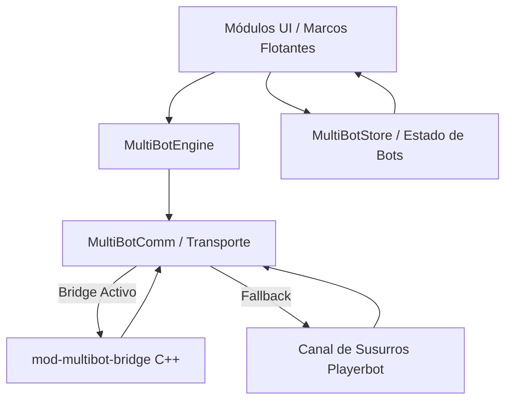

# 🔌 Especificación Técnica y Arquitectura de API — MultiBot

[-blue.svg)](https://worldofwanos.com/)

[-gold.svg)](https://worldofwanos.com/)

---

## 📌 Resumen Arquitectónico

**MultiBot** es una suite completa de control e interfaz de usuario para el sistema `mod-playerbots` en World of Warcraft 3.3.5a (WotLK Build 12340). Implementa una arquitectura moderna **Bridge-First** que minimiza la dependencia del chat convencional en favor de mensajes de addon estructurados canalizados a través de `mod-multibot-bridge`.

- **Módulo Oficial:** #21 del Ecosistema Project Jaina.
- **Framework Base:** `AceAddon-3.0`, `AceEvent-3.0`, `AceConsole-3.0`, `AceDB-3.0`, `AceTimer-3.0`.
- **Runtime:** Lua 5.1 (Blizzard Virtual Machine 3.3.5a).

---

## 🏗️ Subsistemas Principales

### 1. `MultiBot` (Core)
Instancia central de la aplicación y punto de enlace de eventos de ciclo de vida (`ADDON_LOADED`, `PLAYER_LOGIN`, `PLAYER_ENTERING_WORLD`).
- `MultiBot:ToggleUI()`: Alterna la visibilidad de los controles principales.
- `MultiBot.RegisterCommandAliases(name, handler, aliases)`: Registro unificado de comandos de barra para clientes 3.3.5a con o sin AceConsole.

### 2. `MultiBotComm` (Capa de Red y Transporte)
Gestiona la transmisión y recepción de tramas hacia el servidor.
- **Prefijos Registrados:** `MB_REQ` (solicitud) y `MB_RES` (respuesta estructurada).
- **Control de Modo:** Detecta en el handshake si `mod-multibot-bridge` está disponible.
- **Fallback Automático:** Si el bridge no responde en el arranque, redirige las instrucciones como cadenas de texto dirigidas al bot objetivo mediante `SendChatMessage(msg, "WHISPER", nil, botName)`.

### 3. `MultiBotStore` (Almacén de Estado y Memoria)
Conserva la instantánea actual de los bots asociados al jugador y al grupo:
- Identidad, clase, nivel, especialización y rol asignado (Tank, DPS, Healer).
- Estrategias activadas (`co', 'nc', 'dps', 'heal', 'tank', 'threat', etc.).
- Inventario remoto del bot, piezas de armadura equipadas y árbol de talentos.

### 4. `MultiBotEngine` (Despachador Táctico)
Convierte las interacciones del usuario en directivas de combate:
- **Formaciones:** `Follow`, `Stay`, `Near`, `Arrow`, `Shield`, `Circle`, `Line`, `Chaos`.
- **Comportamiento Táctico:**
  - `Attack`: Ordena a los bots designados cargar contra el objetivo marcado o seleccionado.
  - `Flee`: Ordena a los bots retirarse hacia la posición del jugador evitando combate activo.
  - `Disperse`: Dispersión de área ante mecánicas de daño zonal de jefes de banda.
- **Asignación de Roles:** Conmutación atómica de perfiles tácticos por clase.

### 5. `MultiBotThrottle` & `MultiBotAsync` (Rendimiento)
- `MultiBotThrottle`: Limita la tasa de emisión de paquetes para evitar saturación de ancho de banda.
- `MultiBotAsync`: Ejecución de consultas segmentadas en lotes distribuidos a lo largo de varios ciclos de renderizado.

---

## ⌨️ Comandos de Consola (Slash Commands)

| Comando | Alias Soportados | Acción |
|---|---|---|
| `/mb` | `/multibot`, `/mbot`, `/wpmb`, `/wpbot` | Alternar la visibilidad de la barra principal de MultiBot. |
| `/mbopt` | `/wpmbopt` | Abrir el panel de configuración y preferencias. |
| `/mbfakegm` | — | Activar o desactivar simulación de interfaz de Game Master. |
| `/mbdebug` | — | Activar, desactivar o alternar telemetría de depuración (`/mbdebug <subsistema> <on\|off\|toggle>`). |
| `/mbclass` | — | Consulta o prueba de perfiles de clase de bots. |

---

## 💾 Persistencia de Datos (SavedVariables)

### Por Personaje (`SavedVariablesPerCharacter`)
- `MultiBotSave`: Configuración de interfaz, coordenadas de marcos flotantes y visibilidad por personaje.
- `MultiBotDB`: Opciones de usuario gestionadas por `AceDB-3.0`.
- `MultiBotSaved`: Perfiles y esquemas de estrategias guardados.

### Global por Cuenta (`SavedVariables`)
- `MultiBotGlobalSave`: Preferencias generales del addon, ajustes de minimapa, configuraciones de throttling y atajos de teclado globales.
